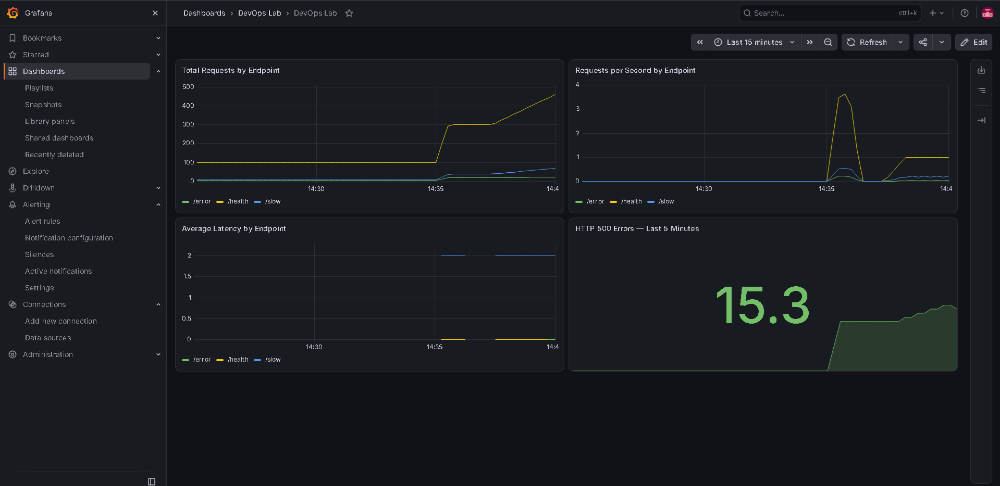
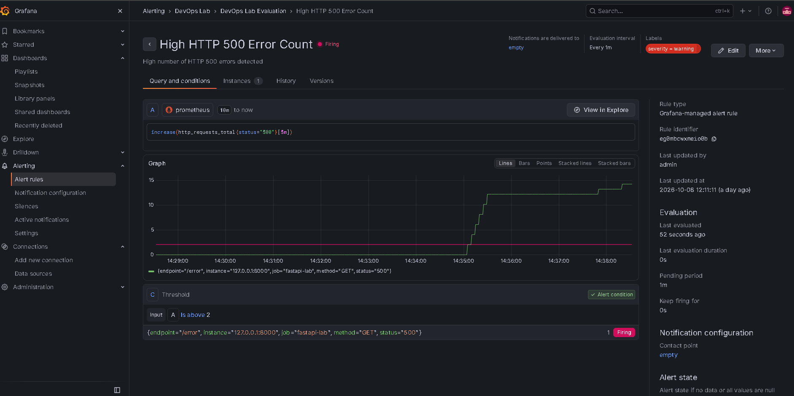
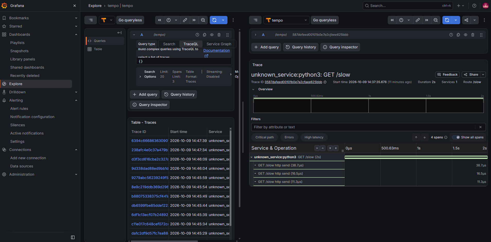

# DevOps Observability Lab

A small learning project created to practice basic DevOps and observability concepts using FastAPI, Prometheus, Grafana, OpenTelemetry and Grafana Tempo.

The goal of this lab is to understand how metrics, logs, traces, dashboards and alerts work together in a monitored application.

## Technologies

- Python
- FastAPI
- Linux / WSL
- Prometheus
- PromQL
- Grafana
- OpenTelemetry
- Grafana Tempo
- Git / GitHub

## Architecture

```text
FastAPI
├── Metrics → Prometheus → Grafana
└── Traces → OpenTelemetry → Tempo → Grafana
```

## Application Endpoints

- `/health` — returns a healthy response
- `/slow` — simulates a slow request
- `/error` — simulates an HTTP 500 error
- `/metrics` — exposes Prometheus metrics

## What I Practiced

- Linux command-line basics
- Monitoring application metrics
- Prometheus scraping
- Basic PromQL queries
- Grafana dashboards
- HTTP 500 alerting
- OpenTelemetry tracing
- Trace visualization with Grafana Tempo
- Basic SLI, SLO and SLA concepts
- Runbook documentation

## Alert

The lab includes an alert that fires when more than 2 HTTP 500 errors occur within 5 minutes.

See:

`RUNBOOK.md`

## Project Structure

```text
devops-observability-lab/
├── config/
│   ├── prometheus/
│   └── tempo/
├── grafana/
├── main.py
├── README.md
├── RUNBOOK.md
├── requirements.txt
└── .gitignore
```

## Demo Screenshots

The images below show a small local test with simulated traffic, used only to validate the dashboard, alerting and tracing setup.

### Grafana Dashboard



### HTTP 500 Alert



### Distributed Trace




## Purpose

This repository is a study project focused on building practical familiarity with observability and DevOps fundamentals.
